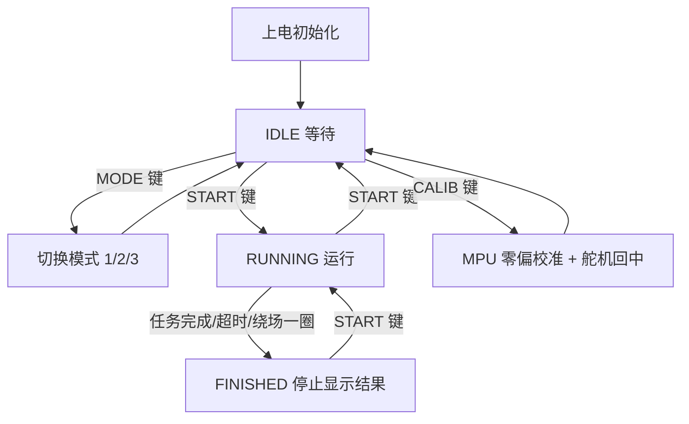
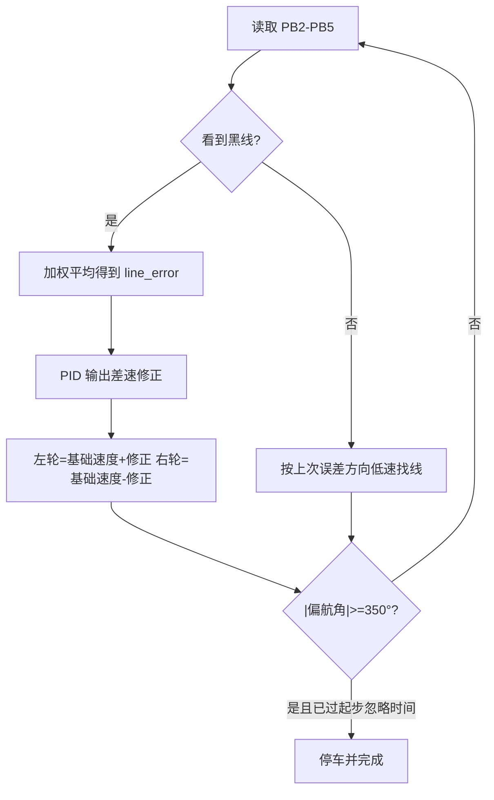
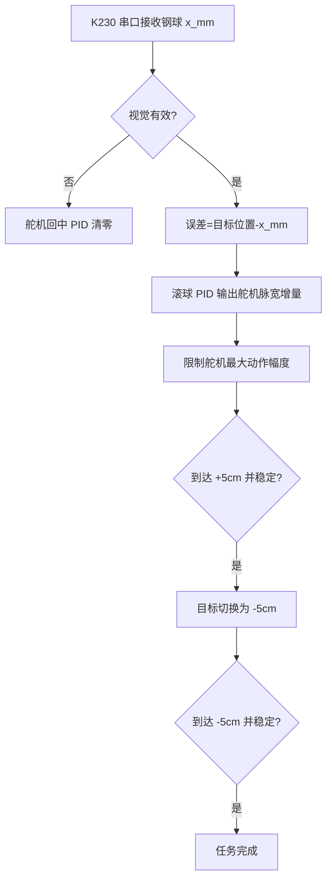

# 软件控制流程

## 总状态机

## 模式一：巡线

跑完一圈的判定纯靠 MPU6050 累计偏航角：起步时清零，转过
`ROBOT_LINE_FINISH_YAW_DEG`（默认 350°）即视为绕场一圈完成，不再依赖
四探头全黑的视觉停车线标记。

## 模式二：滚球

## 模式三：巡线 + 滚球

模式三每个控制周期同时执行：

1. 红外巡线闭环，输出左右轮差速。
2. K230 识别钢球位置，输出舵机角度。
3. MPU6050 更新相对初始角度，用于记录和后续报告分析。

这两个闭环共享同一个 5 ms 主循环。实际调车时，先让巡线单独稳定，再逐步增加滚球 PID。
